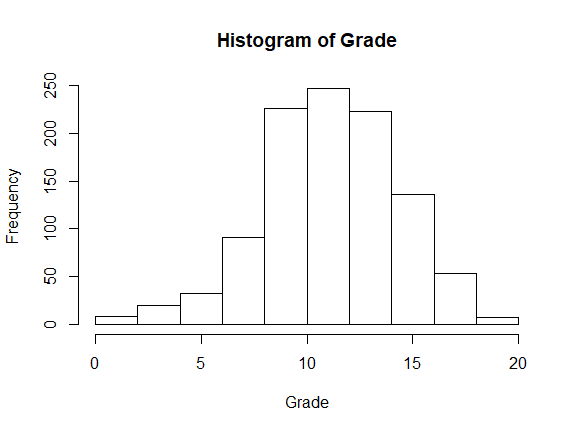
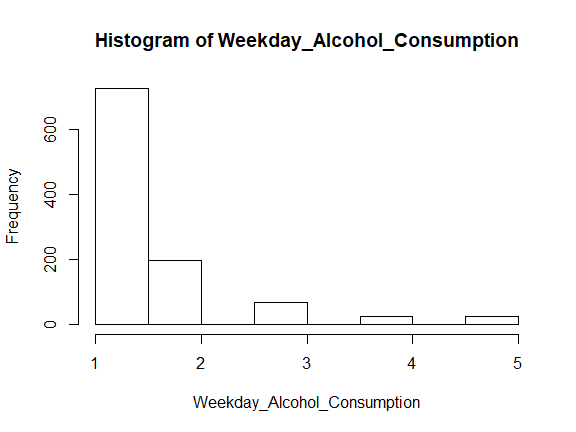
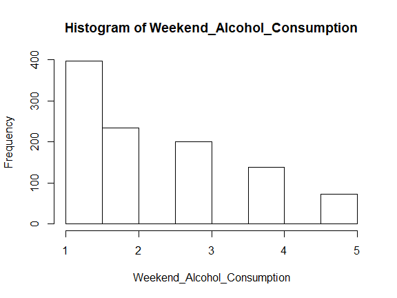
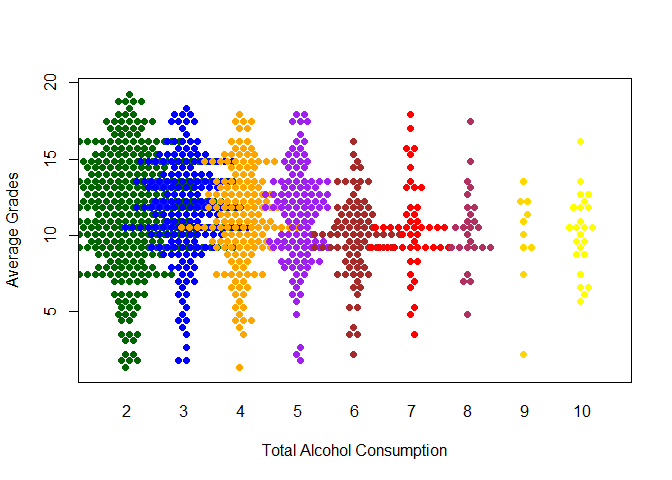
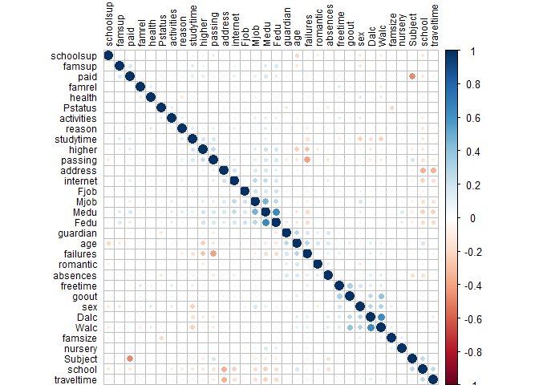
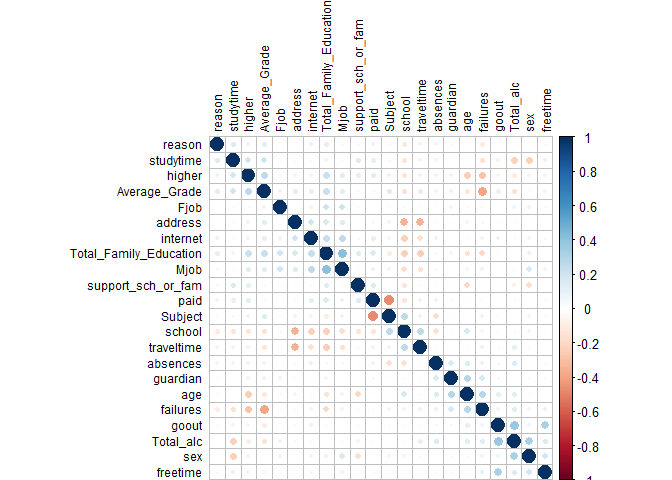
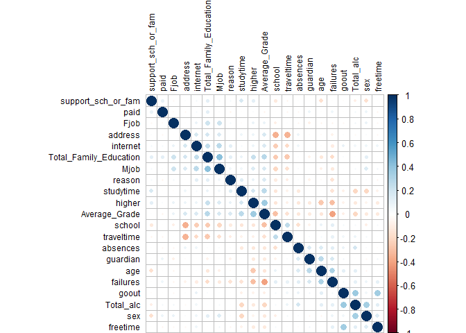
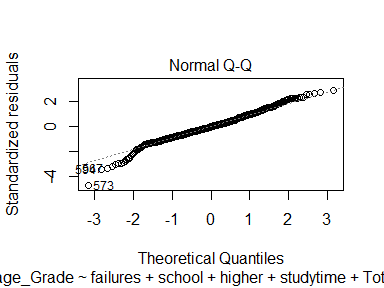
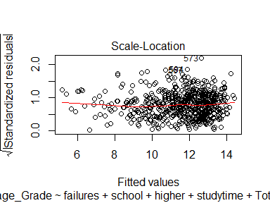
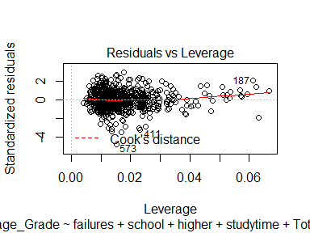

Effect of Alcohol Consumption On Students' Grades
================
Kate Jones, Akshay Kamath, Purvi Thakor
November 16, 2017

### Analysis of Alcohol Use and Student Success

#### Background:

We were interested in determining how alcohol consumption for students related to their academic success. Kate is a Resident Advisor for GW, and the university often emphasizes alcohol awareness and the impacts of substance use on class performance. However, we wanted to determine if these claims are backed up by the data.

#### Data:

We were able to find a dataset on Kaggle relating to alcohol consumption and grades for students in a secondary school. The data contained 35 variables on student life, and had observations for 1044 students. We created additional variables to eliminate duplicate students (concat and count), to determine average grade (avggrade), and to express if a student was passing or failing (passing).

``` r
names(data)
```

    ##  [1] "student_id" "school"     "sex"        "age"        "address"   
    ##  [6] "famsize"    "Pstatus"    "Medu"       "Fedu"       "Mjob"      
    ## [11] "Fjob"       "reason"     "guardian"   "traveltime" "studytime" 
    ## [16] "failures"   "schoolsup"  "famsup"     "paid"       "activities"
    ## [21] "nursery"    "higher"     "internet"   "romantic"   "famrel"    
    ## [26] "freetime"   "goout"      "Dalc"       "Walc"       "health"    
    ## [31] "absences"   "G1"         "G2"         "G3"         "Subject"   
    ## [36] "Count"      "avggrade"   "passing"

``` r
nrow(data)
```

    ## [1] 1044

#### Research:

To determine what grade constitutes passing we reserached the grading scale for Portugal (where the study took place) and learned that a grade over 10 (out of 20) is considered sufficient, or passing. Other analysis which has been conducted on student success and alcohol is largely qualitative, while our analysis will be quantitative in nature.

#### Question Selection:

Based on this, we settled on the research question "does alcohol consumption affect student academic performance". We will measure alcohol consumption using the variables "Dalc" (Weekday alcohol consumption on a scale from 1 to 5) and "Walc" (Weekend alcohol consumption). We will measure academic success using average grade and whether or not a student passes the course.

### Exploratory Data Analysis

What is the typical distribution of student grades?

``` r
hist(Grade)
```



``` r
summary(Grade)
```

    ##    Min. 1st Qu.  Median    Mean 3rd Qu.    Max. 
    ##   1.333   9.333  11.333  11.267  13.333  19.333

Grades appear to be distributed relatively normally, with the mean above "passing". The percentage of students whose average grade is passing (above 10) is:

    ## [1] 69.25287

What about the distribution of alcohol consumption?

``` r
hist(Weekday_Alcohol_Consumption)
```



``` r
summary(Weekday_Alcohol_Consumption)
```

    ##    Min. 1st Qu.  Median    Mean 3rd Qu.    Max. 
    ##   1.000   1.000   1.000   1.494   2.000   5.000

``` r
hist(Weekend_Alcohol_Consumption)
```



``` r
summary(Weekend_Alcohol_Consumption)
```

    ##    Min. 1st Qu.  Median    Mean 3rd Qu.    Max. 
    ##   1.000   1.000   2.000   2.284   3.000   5.000

The distribution of alcohol consumption appears skewed, with a right-tailed distribution.

Does any correlation exist between the two?

``` r
cor(Grade, Weekday_Alcohol_Consumption)
```

    ## [1] -0.1432829

``` r
cor(Grade, Weekend_Alcohol_Consumption)
```

    ## [1] -0.1339022

The correlations are negative, which is to be expected. This implies that more alcohol consumption relates to lower grades. However, the correlations are very very weak-- .13 and .14. This means there is very little relationship between the two variables.

We also construted another plot of grades compared to alcohol consumption, showing similar trends.

``` r
library(beeswarm)
#install.packages("beeswarm")

Color=c("darkgreen","blue","orange","purple","brown","red","maroon","gold","yellow","navyblue")
beeswarm(data=data,avggrade~Total_Alcohol_Consumption,xlab="Total Alcohol Consumption",ylab="Average Grades", method="hex", col=Color, cex=1, pch=19 ,bg=10 ,spacing=1)
```



We wondered if maybe the variation in grades couldn't be explained by alcohol consumption alone, so we created a correlation plot for all of the variables.

``` r
library(corrplot)
corrplot(cor(data), order="hclust", tl.col="black", tl.cex=.75)
```



Based on this correlation plot, we see a few major correlations:
1) Subject and paid (whether you pay a tutor for extra classes) are correlated
2) Address is correlated with which school you attend and with the time it takes to get to school
3) Past failures in classes correlate strongly with average grade, whether you're passing, and whether you want to pursue higher education
4) Mother's and Father's education are strongly correlated
5) Weekly alcohol consumption is strongly correlated with your free time, gender, whether you go out, whether you want higher education, and your daily alcohol consumption
6) Free time is correlated to whether you go out
7) Average grade is influenced by whether or not you want higher education (to go to college), your study time, your parents' education, your past failures, your daily alcohol consumption, your subject, and your school.

To further explore these correlations, we dropped variables with no correlation to any other variables in the dataset (eg romantic relationships). We also created a few more complex variables: Family Education (combined mother's and father's education), Total Alcohol Consumption (Daily and Weekly), and School + Family Support (School Support and Family Support combined).

``` r
library(corrplot)
corrplot(cor(newdata), order="hclust", tl.col="black", tl.cex=.75)
```



Finally, we wanted to see if there was a difference between students taking math and portugese classes. We found that while almost no trends existed for the math students, the students in portugese classes did see significant impacts of study time, past failures, alcohol consumption, desire for higher education, and a few other factors.

``` r
por_data<-newdata[which(newdata$Subject==2),]
por_data$Subject<-NULL
por_data<-data.frame(lapply(por_data, as.numeric))
```

``` r
corrplot(cor(por_data), order="hclust", tl.col="black", tl.cex=.75)
```



With this subset of variables in mind, and initial correlations established, we moved to creating regression models (multiple linear regression and logistic regression) to determine the relationship between alcohol (or other factors) and student grades.

### Model Selection

##### Multiple Linear Regression

``` r
##full model which includes all variables
r1<- lm(Average_Grade~., data=por_data)

##null model which includes no variables
null=lm(Average_Grade~1, data=por_data)

##using stepwise selection to select the best model (note: forward selection produced the same result)
 step(null, scope=list(lower=null, upper=r1), direction="both")
```

This led us to a model which explains average grade using past failures, school attended, whether the student wants higher education, how much time they study, their alcohol consumption, family education, support systems, their sex, absences, and reason for attending their school.

We then looked to see the significance levels of each of these variables to determine how large of an affect alcohol consumption may play in grades.

``` r
r_forward<-lm(formula = Average_Grade ~ failures + school + higher + studytime + Total_alc + Total_Family_Education + support_sch_or_fam +  sex + absences + reason, data =por_data)
summary(r_forward)
```

    ## 
    ## Call:
    ## lm(formula = Average_Grade ~ failures + school + higher + studytime + 
    ##     Total_alc + Total_Family_Education + support_sch_or_fam + 
    ##     sex + absences + reason, data = por_data)
    ## 
    ## Residuals:
    ##      Min       1Q   Median       3Q      Max 
    ## -10.9961  -1.4150  -0.0329   1.4116   6.7253 
    ## 
    ## Coefficients:
    ##                        Estimate Std. Error t value Pr(>|t|)    
    ## (Intercept)            10.33994    0.85721  12.062  < 2e-16 ***
    ## failures               -1.20955    0.16596  -7.288 9.31e-13 ***
    ## school                 -1.26712    0.20596  -6.152 1.35e-09 ***
    ## higher                  1.59531    0.32226   4.950 9.49e-07 ***
    ## studytime               0.39185    0.11827   3.313 0.000975 ***
    ## Total_alc              -0.14186    0.05003  -2.835 0.004723 ** 
    ## Total_Family_Education  0.19311    0.04836   3.993 7.28e-05 ***
    ## support_sch_or_fam     -0.47129    0.15895  -2.965 0.003139 ** 
    ## sex                    -0.46316    0.20485  -2.261 0.024100 *  
    ## absences               -0.04576    0.02070  -2.211 0.027422 *  
    ## reason                  0.11775    0.07829   1.504 0.133056    
    ## ---
    ## Signif. codes:  0 '***' 0.001 '**' 0.01 '*' 0.05 '.' 0.1 ' ' 1
    ## 
    ## Residual standard error: 2.318 on 638 degrees of freedom
    ## Multiple R-squared:  0.3413, Adjusted R-squared:  0.331 
    ## F-statistic: 33.06 on 10 and 638 DF,  p-value: < 2.2e-16

``` r
plot(r_forward)
```



The output from this model shows that almost all variables are statistically significant. With an F-test returning a p-value of &lt;.0001, we can reject the hypothesis that the model is not statistically significant.

Furthermore, the "Total\_alc" variable returns a coefficient of -.14, with a p-value of .0047. This implies that a one unit increase in alcohol consumption (on a 10 point scale) would lead to an expected drop in a student's average grade of .14 (on a 20-point scale). The fact that the coefficient is negative means that our research question seems to be answered how we expected-- increased alcohol consumption has a negative impact on studnet preformance. Additionally, the result is significant at a 99% level.

Aside from answering our research question about alcohol consumption, this model also provides interesting results regarding which other factors contribute to student preformance. The strongest predictors of student grades were previous failures, which school they attend, whether they desire higher education, and how much time they study. Logically, more past failures had a negative relationship with expected grades. A desire for higher education and a use of more study time both related to higher predicted grades.

Finally, we wanted to ensure the validity of our model. It had a relatively small R-squared (.33 adjusted), but a very significant p-value, as discussed above. We created diagnostic plots to test model assumptions. First, a Residuals v. Fitted plot does not show strong evidence of heteroskedasticity. Next, a Q-Q plot showed almost perfect normality of the data, as the points followed a 45-degree line almost exactly. Furthermore, no points fell outside of Cook's Distance, implying that no points were overly influntial in skewing the model. All of these plots demonstrate that no model assumptions were violated here.

##### Logistic Regression

``` r
#first, establishing a data set with a pass/fail variable
por_data<-newdata[which(newdata$Subject==2),]
por_data$Subject<-NULL
por_data<-data.frame(lapply(por_data, as.numeric))
log_data<-por_data
log_data$pass=ifelse(log_data$Average_Grade >=10, c(1), c(0))
log_data<-log_data[-c(21)]
```

Next, we created a logistic model to see whether we would be able to effectively predict whether a student would pass or fail a course, based on these variables.

``` r
#Creating a full and null model

##full model which includes all variables
l1<- glm(pass~., data=log_data, family=binomial)

##null model which includes no variables
null=glm(pass~1, data=log_data, family=binomial)

##using stepwise selection to select the best model 
step(null, scope=list(lower=null, upper=l1), direction="both")
```

Model which was selected using stepwise selection for a logit model:

``` r
logit<-glm(formula = pass ~ failures + school + higher + studytime + 
    sex + absences + Total_Family_Education + support_sch_or_fam, 
    family = binomial, data = log_data)
summary(logit)
```

    ## 
    ## Call:
    ## glm(formula = pass ~ failures + school + higher + studytime + 
    ##     sex + absences + Total_Family_Education + support_sch_or_fam, 
    ##     family = binomial, data = log_data)
    ## 
    ## Deviance Residuals: 
    ##     Min       1Q   Median       3Q      Max  
    ## -2.7369   0.2230   0.3688   0.5741   2.3209  
    ## 
    ## Coefficients:
    ##                        Estimate Std. Error z value Pr(>|z|)    
    ## (Intercept)             1.40754    0.91658   1.536 0.124627    
    ## failures               -1.47460    0.22325  -6.605 3.97e-11 ***
    ## school                 -1.49959    0.24600  -6.096 1.09e-09 ***
    ## higher                  1.25945    0.33296   3.783 0.000155 ***
    ## studytime               0.37553    0.15462   2.429 0.015150 *  
    ## sex                    -0.64588    0.24014  -2.690 0.007153 ** 
    ## absences               -0.05653    0.02374  -2.382 0.017235 *  
    ## Total_Family_Education  0.13844    0.06162   2.247 0.024654 *  
    ## support_sch_or_fam     -0.29362    0.20246  -1.450 0.146979    
    ## ---
    ## Signif. codes:  0 '***' 0.001 '**' 0.01 '*' 0.05 '.' 0.1 ' ' 1
    ## 
    ## (Dispersion parameter for binomial family taken to be 1)
    ## 
    ##     Null deviance: 718.15  on 648  degrees of freedom
    ## Residual deviance: 500.61  on 640  degrees of freedom
    ## AIC: 518.61
    ## 
    ## Number of Fisher Scoring iterations: 5

Similarly to our multiple linear regression, our logit model has all but one of its variables creating a statistically significant impact on student preformance. Past failures, school atended, whether a student wants higher education, and their amount of time studying, are all still the strongest predictors of whether a student will pass a class. However, unlike our multiple linear regression, the logit model does not include alcohol consumption as a dependent variable. This likely indicates that while alcohol influences one's numeric grade, it doesn't do so enough to influence whether a student passes or fails a course.

### Conclusions

#### Reliability:

Despite a small R-squared, our multiple linear regression model was statistically significant when an F-test was conducted (p-value &lt;.0001) and included significant relationships between student grades and all but one of the dependent variables included. Stepwise and Forward selection both arrived at this combination of dependent variables for the model. Furthermore, diagnostic plots were examined which determined that no model assumptions were violated in the construciton of this model.

Regarding our research question, we find that alcohol consumption does seem to predict a decrease in student grade preformance, based on a negative relationship between total alcohol consumption and average student grades. This relationships seems to be reliable as a result of the low p-value associated with the coefficient. Other reliable predictors of student grades were past failures, school attended, study time, and desire for future education.

When examining a logistic model, we wanted to predict whether students passed a class based on these variables. Stepwise selection selected a model which did not include alcohol consumption. What this seems to indicate is that alcohol consumption significantly affects your numeric grade, but does not have a significant impact on whether you pass or fail a course. This makes sense-- students who are already passing or failing a course may have grades influenced by their drinking habits, but drinking will not make the tipping point between passing and failing.

For reliability of our logit model, we created a confusion matrix:

``` r
predict <- predict(logit, type = 'response')
table(log_data$pass, predict > 0.5)
```

    ##    
    ##     FALSE TRUE
    ##   0    71   86
    ##   1    31  461

This indicates a success rate of 82%, with a 13% false positive rate and a 5% false negative rate. This is not a perfect classification, but the model seems to be reliable overall with predicting whether a student will pass or fail a class.

#### Possible Predictions:

Some predictions we can make with our models basically consist of a student's expected average grade, or whether we expect a student to pass or fail, based on various aspects of their home and social lives.

For example, we can predict the likelihood that a student will pass a class based on past failures, school, desire for higher ed, time studying, sex, absences, family education, and support.

Similarly, we could find the expected grade of a student based on their past failures, school, desire for higher ed, time studying, alcohol consumption, family education, support, sex, and absences.

#### Limitations:

There were a few limitations with our data-- first, the size of the data. Since we only had information on two schools, more data could have led to more accurate predictions. Additionally, if we had more data, we could have done training and testing data for our logistic model. We were limited by the sample size and didn't want to split up the data whne we only had a few observations.

Another limitation was the structure of the data-- a lot of our variables were categorical variables. Alcohol consumption was a categorical variable on a scale from "low" to "high", rather than a numeric variable. Similarly, grades were on a 20 point scale, rather than a continious percentage scale. More numeric variables could have possibly enabled more accurate analysis.

Going off of this, a seeming limitation of our model is the small R-squared value on the regressions. However, this is likely the result of many categorical or factor variables.

Additional analysis which may be helpful for improving results would be a more complete analysis of student behavior, rather than this limited survey. Overall, however, we were able to establish a relationship between many related factors in our existing data set.
